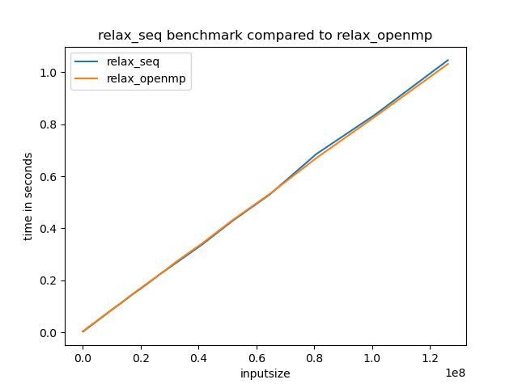

# Parallel_benchmarker
A benchmarking tool for benchmarking and comparing C and C++ applications for execution time (made for Parallel computing RU)

## Requirements
```
python 3.#.#
pip3 install matplotlib argparse
```
## IMPORTANT
In order to get the program to work with an argument, the main function needs to be substituted with this :
`int main(int argc, char **argv)` and `n = N` be substituted by `n = atoi(argv[1])`.
After compiling the program, for example with `gcc relax.c -o relax`, the command `./relax 10000000`
will execute program with the default input.
Since update V0.1 I decided to implement a universal timer that times only the workloop and can be used for all the scripts.
### Implementing the timer
before the start of the work loop (in the main function) paste the following code:
```
struct timespec start;
   struct timespec end;
   clockid_t clock = CLOCK_MONOTONIC;
   clock_gettime(clock, &start);
    do{...}while.... #main work loop goes here
   clock_gettime(clock, &end);
   struct timespec elapsed = get_elapsed_time(&start,&end);
   printf("%lld %lld", elapsed.tv_sec, elapsed.tv_nsec);  
```
As you can see we call the function `get_elapsed_time()`. You will have to paste this function as a whole outside and above the main function.

```
struct timespec get_elapsed_time(struct timespec* start,struct timespec* stop)
{
  struct timespec elapsed_time;
  if ((stop->tv_nsec - start->tv_nsec) < 0) 
  {
    elapsed_time.tv_sec = stop->tv_sec - start->tv_sec - 1;
    elapsed_time.tv_nsec = stop->tv_nsec - start->tv_nsec + 1000000000;
  } 
  else 
  {
    elapsed_time.tv_sec = stop->tv_sec - start->tv_sec;
    elapsed_time.tv_nsec = stop->tv_nsec - start->tv_nsec;
  }

  return elapsed_time;
}
```
Using this technique it will give us the wallclock time of the workloop execution.
MAKE SURE TO REMOVE ANY OTHER PRINTF STATEMENTS FROM YOUR CODE!!!!!


## Usage:
```
  -h, --help            show this help message and exit
  -e EXECUTABLE, --executable EXECUTABLE
                        executable you want to benchmark
  -i MAX_INPUT_SIZE, --Max_Input_Size MAX_INPUT_SIZE
                        maximum input you want to benchmark (default: 10000000)
  -c COMPETITOR, --competitor COMPETITOR
                        competitor executable to compare benchmark
  -f, --fabians_feature
                        a flag which can be set to compensate for possible background processes slowing down the
                        script (aka run the same input size 5 times)

```
## Examples:
```
python3 benchmark.py -e relax -c relax_optimised -i 150000 
```
Comparing the time performance of relax vs an optimised version using exponentially growing input until 150000.
```
python3 benchmark.py -e relax_openmp -i 150000
```
benchmarking a script based on an exponentially increasing input until 150000.

## Example output:


##Question:
feel free to ask in the RU twaars app

